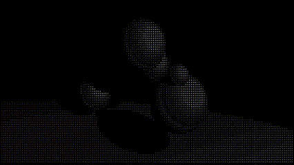

# ASCII Graphics Renderer

Welcome to **ASCII Graphics Renderer**, a unique graphics engine that uses raymarching to render scenes with ASCII characters. This project demonstrates advanced graphics techniques and efficient Java programming to create visually appealing scenes using only text. 



## Features

- **Raymarching Engine**: Implements raymarching to render any shape that can be defined with a signed distance function.
- **ASCII Rendering**: Utilizes ASCII characters to represent different shades in the scene.
- **Reflections**: Supports reflections to add realism and depth to the rendered scenes.
- **Modular Design**: Easily extendable to include new shapes and scene objects.

## Getting Started

### Prerequisites

- **Java**: Ensure you have Java Development Kit (JDK) installed.

### Installation

1. **Clone the Repository**:
    ```bash
    git clone https://github.com/Stermere/ASCII_graphics_renderer
    cd ASCII_Graphics_Renderer
    ```

2. **Compile the Java Code**:
    ```bash
    javac *.java
    ```

3. **Run the Renderer**:
    ```bash
    java Main
    ```
